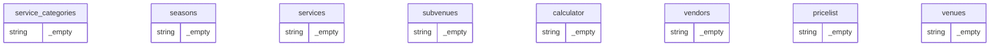

# Database ERD (Auto-generated Draft)

> This Mermaid diagram is an **auto-detected draft** based on CSV headers. Please review and adjust where needed.

## Detected Primary Keys (heuristic)
- **service_categories**: —
- **seasons**: —
- **services**: —
- **subvenues**: —
- **calculator**: —
- **vendors**: —
- **pricelist**: —
- **venues**: —

## Detected Foreign Keys (heuristic)
- **service_categories**: —
- **seasons**: —
- **services**: —
- **subvenues**: —
- **calculator**: —
- **vendors**: —
- **pricelist**: —
- **venues**: —