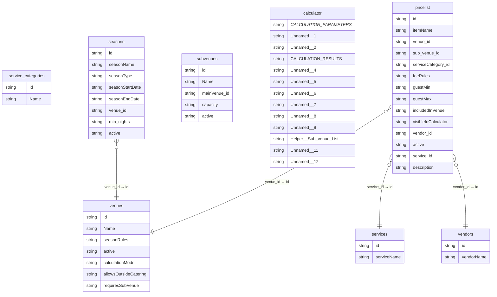

# Database ERD (Generated)

## Detected Primary Keys (heuristic)
- **service_categories**: id
- **seasons**: id
- **services**: id
- **subvenues**: id
- **calculator**:  CALCULATION PARAMETERS 
- **vendors**: id
- **pricelist**: id
- **venues**: id

## Detected Foreign Keys (heuristic)
- **service_categories**: —
- **seasons**: venue_id → venues.id
- **services**: —
- **subvenues**: —
- **calculator**: —
- **vendors**: —
- **pricelist**: service_id → services.id, vendor_id → vendors.id, venue_id → venues.id
- **venues**: —
